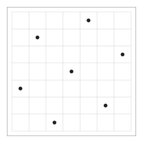
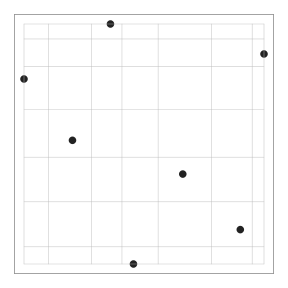
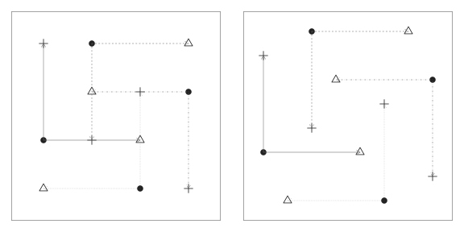
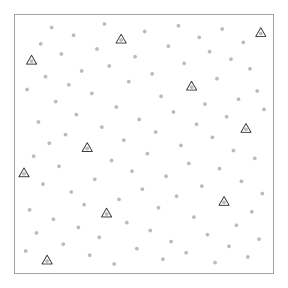
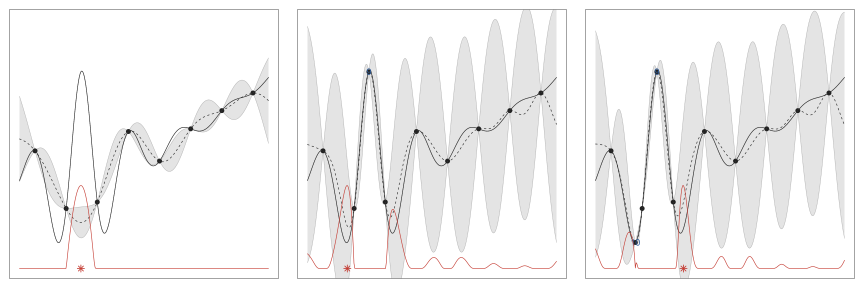

# 基于多保真度数据的贝叶斯优化研究

## 标题页

标题：基于多保真度数据的贝叶斯优化研究
汇报人：Wenje Ma
机构：北京理工大学·数学与应用数学（强基班）·2024 级
指导教师：王典朋

**讲稿**

大家好，我是马文杰，我作报告的题目是《基于多保真度数据的贝叶斯优化研究》。

---

## 形式化命题

### 形式化命题

设计参数 $\boldsymbol{x}\in\left[0,1\right]^{p}$，仿真器为黑箱 $y=h\left(\boldsymbol{x}\right)$。现存在两条评估通道，成本与精度分层：

- 低保真 $h_\mathrm{L}\left(\boldsymbol{x}\right)$：成本 $c_\mathrm{L}$、有系统偏差；
- 高保真 $h_\mathrm{H}\left(\boldsymbol{x}\right)$：成本 $c_\mathrm{H}\gg c_\mathrm{L}$、准确。

两种保真之间存在偏差结构，其形式未知。总预算为 15 次高保真当量，定义 $\widehat{h}=h_\mathrm{H}\left(\widehat{\boldsymbol{x}}\right)$。任务：尽可能准确地估计

$$
\widehat{\boldsymbol{x}}\approx\argmin_{\boldsymbol{x}\in\left[0,1\right]^{p}}h_\mathrm{H}\left(\boldsymbol{x}\right)
$$

**讲稿**

先来看本报告的形式化命题：设计参数 bold x 在 p 维标准区间中，仿真器为黑箱 y 等于 h bold x。现存在两条评估通道，低保真的 h L bold x 便宜，成本为 c L，但有系统偏差；高保真的 h H bold x 昂贵，其成本 c H 远大于 c L，且无系统偏差。两种保真之间存在偏差结构，其形式未知。总预算恰好能做 15 次高保真试验，定义 hat bold x 为算法输出的最佳估计点，hat h 为在这些点上测到的高保真值，即 hat h 等于 h H bold x。我们的目标是尽可能准确地估计让 h H bold x 最小的 bold x。

---

## 理论基础

### 最大投影设计

极大极小拉丁超立方抽样设计（莫里斯与米切尔，1995）：

> **图 1**：极大极小拉丁超立方抽样设计

{width=33%}

最大投影设计（约瑟夫等人，2015）：设 $D=\left\{\boldsymbol{x}_1,\dots,\boldsymbol{x}_n\right\}$ 为 $\left[0,1\right]^p$ 上含 $n$ 个点的设计，其准则为

$$
\min_D\sum_{i=1}^{n}\prod_{j\neq i}\frac{1}{\sum_{k=1}^p\left(x_{ik}-x_{jk}\right)^2}
\tag{1}
$$

> **图 2**：最大投影设计

{width=33%}

**讲稿**

先打好理论基础。我们通过贝叶斯公式估计 bold x，有先验与后验。先验阶段我们对函数一无所知，因此初始点必须尽可能均匀地铺满整个空间。为保证每个一维投影中各坐标互不相等，莫里斯与米切尔在 1995 年提出了极大极小拉丁超立方抽样设计；如图 1 所示，它均匀地覆盖了空间。然而，它在高维空间投影效果较差。为此，约瑟夫等人在 2015 年提出了最大投影设计：对 p 维标准区间上含 n 个点的设计 bold x 1 到 bold x n，其准则为（1）。由于分母不能为 0，各坐标互不相等自动得到保证，满足极大极小约束。如图 2 所示，其低维投影也均匀。因此我们采用最大投影设计来选取初始点。

---

### 含投影的最大单因素逐次设计

索博尔总指数 $V_i^\mathrm{tot}$ 的估计式（扬森，1999）：

$$
\widehat{V_i^{\text{tot}}}=\frac{1}{2m}\left\|h\left(\boldsymbol{A}\right)-h\left(\boldsymbol{A}^{\left(\boldsymbol{B}_i\right)}\right)\right\|^2
\tag{2}
$$

式中 $\boldsymbol{A}^{\left(\boldsymbol{B}_i\right)}$ 为将 $m\times p$ 矩阵 $\boldsymbol{A}$ 的第 $i$ 列替换为 $\boldsymbol{B}$ 的第 $i$ 列所得矩阵，$\left\|\cdot\right\|$ 为欧氏范数，$h\left(\boldsymbol{x}\right)$ 为任意待测函数。

索博尔总指数 $V_i^\mathrm{tot}$ 的期望：

$$
\mathrm{E}\left(\widehat{V_i^{\mathrm{tot}}}\right)=\frac{\tau^{2}\sqrt{w_{i}}}{2m}\sum_{j=1}^{m}\left|\boldsymbol{A}_{ji}-\boldsymbol{A}_{ji}^{\left(i\right)}\right|
\tag{3}
$$

索博尔总指数 $V_i^\mathrm{tot}$ 最大化的指标：

$$
\argmax_{\boldsymbol{A}}\sum_{j=1}^{m}\left|\boldsymbol{A}_{ji}-\boldsymbol{A}_{ji}^{\left(i\right)}\right|
\tag{4}
$$

投影映射：

$$
x_i\leftarrow\begin{cases}x_i-\frac{0.25}{m},&x_i<0.5\\
x_i+\frac{0.25}{m},&x_i\ge0.5\\
x_i,&\text{其他}\end{cases},\quad
x_i\leftarrow\begin{cases}x_i+\frac{0.25}{m},&x_i<0.5\\
x_i-\frac{0.25}{m},&x_i\ge0.5\\
x_i,&\text{其他}\end{cases}
\tag{5}
$$

**讲稿**

按重要性给因子排序，就能剔除不重要的因子——因子更少，拟合更容易。第 i 个因子的重要性是索博尔总指数 V i total，扬森在 1999 年给出其估计式（2）。由于估计量是随机的，我们转而考察其期望，得到（3）。因为 tau 乘根号 omega i 对固定的 i 是常数，最大化（3）就归结为最大化 L 1 距离，即通过（4）实现；这就是最大单因素逐次设计。受最大投影设计启发，约瑟夫在 2026 年提出让 bold A 与 bold B 交替采用（5）中的映射来改善投影性质；（5）中的两个分支可以互换。由此得到含投影的最大单因素逐次设计；图 3 将其与不含投影的版本对比——映射后的点不再出现坐标重复。

> **图 3**：最大单因素逐次设计（左）以及含投影的最大单因素逐次设计（右）

{width=67%}

---

### 序贯设计

序贯设计：$\mathcal{X}\subset\mathbb{R}^p$ 为设计空间，先选取 $x_1\in\mathcal{X}$，再按照下述方式逐个添加 $x_2,\dots,x_n$（约瑟夫，2016）：

$$
\boldsymbol{x}_{k+1}=\argmin_{\boldsymbol{x}\in\mathcal{X}}\sum_{i=1}^k\frac{1}{\prod_{j=1}^p\left(x_j-x_{ij}\right)^2}
\tag{6}
$$

其中 $k=1,\dots,n-1$。

**讲稿**

我们不必一次性用完整个高保真预算。可以先构建一个小型初始设计、采集数据，再决定下一组试验放在哪里。这种灵活的策略就是序贯设计，机器学习中又称主动学习；与极大极小拉丁超立方设计不同，最大投影设计天然支持它。在 blackboard bold R 的 p 维空间中定义 calligraphic X 为设计空间。约瑟夫在 2016 年提出先取 x 1 作为初始点，再按（6）逐个添加 x 2 到 x n，其中 k 从 1 到 n 减 1。事实上，（6）就是把最大投影准则（1）改写成了迭代形式。我们将用它进行逐个选点。

---

### 嵌套设计

设存在 $K$ 个保真度等级，其中“1”代表最低保真度，“$K$”代表最高保真度，其对应的不同设计点方案集合为 $\left\{D_i\right\}_{i=1}^K$。

融合公式（肯尼迪与奥黑根，2000）：

$$
h_k\left(\boldsymbol{x}\right)=h_{k-1}\left(\boldsymbol{x}\right)+\delta_k\left(\boldsymbol{x}\right)
\tag{7}
$$

其中 $k=2,\dots,K$，$\delta_k\left(\boldsymbol{x}\right)$ 表示第 $k-1$ 级与第 $k$ 级保真度输出之间的偏差。作出如下高斯过程假设：

$$
\begin{aligned}
&\delta_k\left(\boldsymbol{x}\right)\sim\mathcal{GP}\left\{0,\tau_k^2R_k\left(\cdot\right)\right\}\\
&h_\mathrm{L}\left(\boldsymbol{x}\right)\sim\mathcal{GP}\left\{\mu,\tau_\mathrm{L}^2R_\mathrm{L}\left(\cdot\right)\right\}
\end{aligned}
\tag{8}
$$

> **定义**（高斯过程）：若对于任意选取的 $\boldsymbol{x}_1,\dots,\boldsymbol{x}_n$ 以及任意整数 $n\ge1$，向量 $\boldsymbol{Y}=\left\{Y\left(\boldsymbol{x}_1\right),\dots,Y\left(\boldsymbol{x}_n\right)\right\}'$ 服从多元正态分布，则称随机函数 $Y\left(\boldsymbol{x}\right)$ 为高斯过程。

嵌套设计（肯尼迪与奥黑根，2000）：$D_1\supset D_2\supset\dots\supset D_K$。

序贯最大熵设计问题：

$$
\begin{aligned}D_1^*&=\argmax_{D_1}\left|\boldsymbol{R}_1\left(D_1,D_1\right)\right|\\
D_2^*&=\argmax_{D_2\subseteq D_1^*}\left|\boldsymbol{R}_2\left(D_2,D_2\right)\right|\end{aligned}
\tag{9}
$$

其中 $\left|\cdot\right|$ 为行列式，$\boldsymbol{R}_k\left(D,D'\right)$ 为第 $k$ 保真度层级的相关矩阵，其 $\left(i,j\right)$ 元素为 $R_k\left(\boldsymbol{a}_i-\boldsymbol{b}_j\right)$。从 $D_1$ 中剔除的最优样本点为（约瑟夫，2026）：

$$
x^*_k=\argmax_{x_k\in D_1}\sum_{j\neq k}\frac{1}{\prod_{l=1}^{p}\left\{\left|x_{kl}-x_{jl}\right|+\beta_{l}\right\}^{2}}
\tag{10}
$$

> **图 4**：包含两个保真度层级的嵌套设计

{width=33%}

**讲稿**

假设存在 K 个保真度等级，1 为最低、K 为最高，设计点集为 D i，i 从 1 到 K。肯尼迪与奥黑根按（7）融合数据，并假设服从（8）中的高斯过程。回顾：高斯过程是任意有限点集处的取值服从多元正态分布的随机函数——是多元正态向任意维度的推广。他们还提出了嵌套设计：D 1 包含 D 2，一直包含到 D K。考虑（9）中的两个最大熵设计问题。熵由香农在 1948 年定义，度量不确定性；试验设计追求更大的熵，即更多的信息——这正是最大投影设计所最大化的，因此它非常适合 D 1 star 与 D 2 star。约瑟夫在 2026 年指出，嵌套设计通过从 D 1 star 逐次剔除点来构造 D 2 star，剔除准则为（10）。与（6）不同，分母加入了正常数 beta l：因为 D 2 要从连续的 D 1 中离散取值，连续空间中两点重合概率为 0，离散空间中则不然，所以需要常数防止分母为 0。图 4 展示了两个保真度层级的嵌套设计：三角形点 D 2 是从圆形点 D 1 中选取的离散点，两者都遵循最大投影设计。

### 期望改进法

黑箱函数的优化目标：

$$
\min_{\boldsymbol{x}\in\left[0,1\right]^p}h\left(\boldsymbol{x}\right)
\tag{11}
$$

寻找下一个设计点的迭代公式：

$$
\boldsymbol{x}_{n+1}=\argmin_{\boldsymbol{x}}\widehat{h_n}\left(\boldsymbol{x}\right)
\tag{12}
$$

循环执行该流程直至收敛。由于高斯过程采用贝叶斯框架，因此这类问题被称作贝叶斯优化方法。

期望改进法（琼斯，1998）：设试验设计 $D_n=\left\{\boldsymbol{x}_1,\dots,\boldsymbol{x}_n\right\}$，观测得到数据为 $\boldsymbol{y}_n=\left(y_1,\dots,y_n\right)'$。对潜在函数给定高斯过程先验：

$$
h\left(\boldsymbol{x}\right)\sim\mathcal{GP}\left\{\mu,\tau^2R\left(\cdot\right)\right\}
\tag{13}
$$

其中 $\mu$ 为常数均值，$\tau^2$ 为方差，$R\left(\cdot\right)$ 为相关函数。令 $\boldsymbol{R}_n$ 为 $n\times n$ 相关矩阵、其 $\left(i,j\right)$ 元素为 $R\left(\boldsymbol{x}_i-\boldsymbol{x}_j\right)$，$\boldsymbol{r}_n\left(\boldsymbol{x}\right)$ 为相关向量、其第 $i$ 个元素为 $R\left(\boldsymbol{x}-\boldsymbol{x}_i\right)$，$\boldsymbol{1}_n$ 为 $n$ 维全 1 列向量。

其后验分布（约瑟夫，2026，引理 2.2）：

$$
h\left(\boldsymbol{x}\right)\mid D_n,\boldsymbol{y}_n\sim\mathcal{N}\left\{\mu+\boldsymbol{r}_n\left(\boldsymbol{x}\right)'\boldsymbol{R}_n^{-1}\left(\boldsymbol{y}_n-\mu\boldsymbol{1}_n\right),\tau^2\left(1-\boldsymbol{r}_n\left\{\boldsymbol{x}\right\}'\boldsymbol{R}_n^{-1}\boldsymbol{r}_n\left\{\boldsymbol{x}\right\}\right)\right\}
\tag{14}
$$

令 $h_{\mathrm{min}}^{\left(n\right)}=\min \boldsymbol{y}_n$，定义改进函数：

$$
I\left(\boldsymbol{x}\right)=\max\left\{h_{\mathrm{min}}^{\left(n\right)}-h\left(\boldsymbol{x}\right),0\right\}
\tag{15}
$$

因此，若选取的 $x$ 满足 $h\left(\boldsymbol{x}\right)<h_{\mathrm{min}}^{\left(n\right)}$，则获得改进；否则无改进。

期望改进迭代式：

$$
\boldsymbol{x}_{n+1}=\argmax_{\boldsymbol{x}}\mathrm{E}\left\{I\left(\boldsymbol{x}\right)\mid D_n,\boldsymbol{y}_n\right\}
\tag{16}
$$

期望改进的显式表达式（琼斯，1998）：

$$
\boldsymbol{x}_{n+1}=\argmax_{\boldsymbol{x}}\left\{s_n\left(\boldsymbol{x}\right)\left[u_n\left\{\boldsymbol{x}\right\}\Phi\left(u_n\left\{\boldsymbol{x}\right\}\right)+\phi\left(u_n\left\{\boldsymbol{x}\right\}\right)\right]\right\}
\tag{17}
$$

式中 $\phi\left(\cdot\right)$ 与 $\Phi\left(\cdot\right)$ 分别代表标准正态概率密度函数与标准正态分布函数，$s_n\left(\boldsymbol{x}\right)$ 为后验标准差，$u_n\left\{\boldsymbol{x}\right\}=\left\{h_{\mathrm{min}}^{\left(n\right)}-\widehat{h_n}\left(\boldsymbol{x}\right)\right\}/s_n\left(\boldsymbol{x}\right)$。

显式表达式求导：

$$
\frac{\partial\mathrm{EI}}{\partial\widehat{h_n}\left(\boldsymbol{x}\right)}=-\Phi\left\{u_n\left\{\boldsymbol{x}\right\}\right\}<0,\quad\frac{\partial\mathrm{EI}}{\partial s_n\left(\boldsymbol{x}\right)}=\phi\left\{u_n\left\{\boldsymbol{x}\right\}\right\}>0
\tag{18}
$$

其中 $\mathrm{EI}=s_n\left(\boldsymbol{x}\right)\left[u_n\left\{\boldsymbol{x}\right\}\Phi\left(u_n\left\{\boldsymbol{x}\right\}\right)+\phi\left(u_n\left\{\boldsymbol{x}\right\}\right)\right]$

> **图 5**：对测试函数执行期望改进最小化算法的两次迭代

{width=100%}

**讲稿**

现在进入核心优化问题：在设计空间（取 p 维标准区间）上最小化昂贵的黑箱函数 h bold x，即（11）——一个带边界约束的非线性问题。我们需要一种尽量少求值的全局方法。选取小规模设计 bold x 1 到 bold x n，求 h bold x i 得到 y i，再用便宜的 Gaussian process 代理模型 hat h n bold x 逼近函数，它随序贯过程逐步逼近高保真曲面。最小化代理模型得到下一个点，即（12）；迭代至收敛就是贝叶斯优化。最常用的方法是琼斯等人在 1998 年提出的期望改进法。给定设计 D n 与观测 bold y n，施加高斯过程先验（13）。由约瑟夫（2026）引理 2.2，后验为（14）。令 h n minimum 为 bold y n 的最小值，定义改进函数 I 如（15）：当 h bold x 低于 h n minimum 时产生改进。由于 I 是随机的，我们最大化其期望，得到迭代式（16）。琼斯等人给出了它的显式形式（17），求导得到（18）：期望改进随 hat h n bold x 递减、随 s n bold x 递增，兼顾优化与代理模型精度。图 5 展示了在测试函数上执行两次迭代，逐渐定位其最小值与次小值。

---

### 测试函数

一维测试函数（约瑟夫，2026）：

$$
h\left(x\right)=\frac{\sin\left(10\pi x\right)}{1+64\left(x-0.25\right)^2}+x^2
\tag{19}
$$

其中 $x\in\left[0,1\right]$。

二维布兰宁函数（苏尔雅诺维奇、宾厄姆，2013）：

$$
f\left(x\right)=\left(x_2-\frac{5.1}{4\pi^2}x_1^2+\frac{5}{\pi}x_1-6\right)^2+10\left(1-\frac{1}{8\pi}\right)\cos x_1+10
\tag{20}
$$

其中 $ x_1\in\left[-5,10\right]$、$x_2\in\left[0,15\right]$。

简单可加函数（约瑟夫，2026）：

$$
h\left(x\right)=\sum_{k=1}^{4}\frac{1}{k}\sin\left(\left\{k^2+1\right\}\pi x_k\right)
\tag{21}
$$

其中 $\boldsymbol{x}\in\left[0,1\right]^4$。

模拟钻孔水流的函数（莫里斯等人，1993）：

$$
y=\frac{2\pi x_3\left(x_4-x_6\right)}{\log\left(\frac{x_2}{x_1}\right)\left\{1+\frac{2x_7x_3}{\log\left(x_2/x_1\right)x_1^2x_8}+\frac{x_3}{x_5}\right\}}
\tag{22}
$$

其中 $x_1\in\left[0.05,0.15\right]$、$x_2\in\left[100,50000\right]$、$x_3\in\left[63070,115600\right]$、$x_4\in\left[990,1110\right]$、$x_5\in\left[63.1,116\right]$、$x_6\in\left[700,820\right]$、$x_7\in\left[1120,1680\right]$、$x_8\in\left[9855,12045\right]$。

**讲稿**

下面选取 1、2、4、8 维的测试函数，以横向比较整套流程在不同维度下的表现。它们分别是：约瑟夫（2026）的一维测试函数，即（19）；苏尔雅诺维奇与宾厄姆（2013）的布兰宁函数，即（20）；约瑟夫（2026）的四因子简单可加函数，即（21）；以及莫里斯等人（1993）的模拟钻孔水流函数，即（22）。

---

### 多保真度

构造多保真度函数的通式：

$$
f_\mathrm{L}\left(\boldsymbol{x}\right)=f_\mathrm{H}\left(\boldsymbol{x}\right)+\frac cp\cdot\sum_{i=1}^p\left(x_i-\frac12\right)
\tag{23}
$$

4 个测试函数对应的低保真度版本：

$$
\begin{align*}
f_\mathrm{L}\left(x\right)&=f_\mathrm{H}\left(x\right)+0.3\left(x-\frac{1}{2}\right)
\tag{24}\\
f_\mathrm{L}\left(\boldsymbol{u}\right)&=f_\mathrm{H}\left(\boldsymbol{u}\right)+40\cdot\frac{u_1+u_2-1}{2}
\tag{25}\\
f_\mathrm{L}\left(\boldsymbol{x}\right)&=f_\mathrm{H}\left(\boldsymbol{x}\right)+0.5\cdot\frac{\sum_{k=1}^{4}\left(x_k-\frac{1}{2}\right)}{4}
\tag{26}\\
f_\mathrm{L}\left(\boldsymbol{u}\right)&=f_\mathrm{H}\left(\boldsymbol{u}\right)+70\cdot\frac{\sum_{i=1}^{8}\left(u_i-\frac{1}{2}\right)}{8}
\tag{27}\\
\end{align*}
$$

**讲稿**

函数选择完了，现在构造其低保真度的函数形式。受宋等人（2024）给出的算例启发，我总结出其构造多保真度函数的通式如公式（23）所示。为控制保真程度，常数 $c$ 按 $f_\mathrm{H}$ 值域的 $10\%\sim15\%$ 确定。构造出的 4 个测试函数对应的低保真度表达式如公式（24）到（27）所示。

---

## 完整流程

完整流程 M1：

$$
\boxed{\text{最大投影设计}}\to\boxed{\text{逐次设计}}\to\boxed{\text{嵌套设计}}\to\boxed{\text{期望改进法}}
\tag{28}
$$

空白对照组 M0：

$$
\boxed{\text{最大投影设计}}\to\boxed{\text{期望改进法}}
\tag{29}
$$

仅去掉嵌套设计 S1：

$$
\boxed{\text{最大投影设计}}\to\boxed{\text{逐次设计}}\to\boxed{\text{期望改进法}}
\tag{30}
$$

仅去掉逐次设计 S2:

$$
\boxed{\text{最大投影设计}}\to\boxed{\text{嵌套设计}}\to\boxed{\text{期望改进法}}
\tag{31}
$$

**讲稿**

下面开始实验。完整流程为 M1，即（28）；空白对照组 M0 即（29），去掉逐次设计与嵌套设计。为归因各组件的贡献，我们还构造了 S1，仅去掉嵌套设计（30）；以及 S2，仅去掉逐次设计（31）。

### 标定实验

> **输出 1**：每个维度的最佳高保真次数

```
各维度 n2*： d1=2    d2=14    d4=14    d8=14 
```

按照 M1 的工艺流程会导致序贯与融合组件的发挥空间被预算压缩殆尽。

**讲稿**

标定实验确定预算分配。我们遍历初始高保真次数 2 到 15；次数 1 无解，因为单个点无法拟合高斯过程。对每个设置执行 20 次 M1，预算耗尽时记录 f star，取中位数作为指标，选择中位 f star 最小的 n star。输出 1 给出了最优：1 维为 2，2、4、8 维均为 14。低维函数容易拟合，高维难度爆炸式上升。又因为 2、4、8 维的最优都落在网格端点 14 上，在 15 次高保真当量的极小预算下初始设计主导结果——序贯与融合组件几乎没有发挥空间。

---

### 消融实验

> **输出 2**：强制 5 次高保真后 4 个维度各自的 4 种实验拟合的函数最小值表

```
   config         d1        d2        d4       d8
       M1 -0.6035453 3.1626952 -1.410891 19.68542
       S2 -0.6035453 0.4041193 -1.606024 12.70143
       S1  0.0000000 5.4693989 -1.187530 17.15853
       M0  0.0000000 0.8787899 -1.297524 10.50205
 M0@n2=14 -0.5776889 2.2567621 -1.448456 12.59210
```

1 维情形下期望改进法失效。

4 维情形下融合模型借助大量低保真数据修正了对高保真曲面的近似。

筛选组件在四个维度均未提供正贡献：低保真与高保真之间的偏差结构使得因子重要性排序不可靠。

融合的价值随维度增加而衰减：8 维情形下空白对照反而优于仅融合配置，这是维度灾难在多保真框架下的体现。

相同预算下，少量高保真点配合融合远胜于大量高保真点裸跑。

**讲稿**

消融实验在控制初始设计的条件下识别各组件的边际贡献。直接采用 n 2 star 会令低保真样本过少，流程退化为纯高保真，四类配置无法区分。因此我们强制每个维度恰好 5 次高保真求值，重复 20 次，得到输出 2。1 维情形下，空白对照的 f star 仅为 0——期望改进法完全失效——加入融合后达到全局最优。2 维情形下，仅融合的 S2 达到 0.4041，逼近布兰宁函数全局最优 0.3979，较空白对照的 0.8788 提升超过一倍。4 维情形下，融合把最小值从 -1.2975 改善到 -1.6060。融合正是借助大量低保真数据修正对高保真曲面的近似，使选点更精准；样本稀疏时，它甚至让序贯优化从失效变为可行。然而，筛选从不带来帮助：2 维情形下它把融合结果从 0.4041 恶化到 3.1627，因为低保真与高保真之间的偏差使得因子重要性排序不可靠。融合的价值随维度衰减：1 维质变、2 维逼近全局最优、4 维中等增益，而 8 维情形下空白对照反而胜过仅融合配置——5 个高保真点不足以刻画 8 维的高斯过程，这是维度灾难在多保真框架下的体现。最后，结合两个实验：2 维情形下，在最优初始设计下、预算当量几乎相同时，仅融合的 0.4041 胜过空白对照的 2.2568。相同预算下，少量高保真点配合融合远胜大量高保真点裸跑。

---

## 总结

极小预算下初始设计主导结果，序贯与融合组件的发挥空间被预算压缩殆尽。

融合是决定性组件：低维从失效到全局最优，高维受维度灾难制约。

筛选组件无正贡献：低保真与高保真之间的偏差结构使得因子重要性排序不可靠。

相同预算下，少量高保真点配合融合远胜于大量高保真点裸跑。

**讲稿**

本报告将最大投影设计、含投影的最大单因素逐次设计、嵌套设计融合与期望改进法集成为完整流程 M1，并通过标定与消融定量刻画各组件的贡献。标定：在 15 次当量的极小预算下，最优落在网格端点，初始设计主导，多保真组件几乎没有空间。消融：融合是决定性组件——1 维从失效到可行并达到全局最优；2 维逼近布兰宁最优 0.3979；其价值随维度衰减，8 维失效，因为偏差场无法可靠拟合。筛选从不贡献，因为用低保真信息估计因子重要性不可靠。综合来看：相同预算下，少量高保真点配合融合远胜大量高保真点裸跑。结论是：多保真融合不是增加高保真投入，而是让每一次高保真求值更值钱，其边界由维度灾难决定。

## 展望

改进方向：偏差场 $\delta\left(\boldsymbol{x}\right)$ 的索博尔总指数满足何种界时，低保真给出的因子重要性排序能够保持高保真的真实排序？

**讲稿**

最值得研究的开放问题是筛选的失效：它从不带来帮助，因为我们是靠低保真信息给因子排序，而偏差结构使该排序不可靠。我们观察到了这一现象——但低保真排序在什么条件下才是可信的？下一步是推导排序一致性的判据。有了它，我们可以在筛选之前先做检验，只要排序不可信就跳过筛选，避免误删融合真正需要的因子。这需要新的函数分解与不等式推导，超出了本次实验的范围，将作为后续工作展开。

## 致谢页

谢谢大家的聆听！

**讲稿**

我的报告到此结束，谢谢大家！
