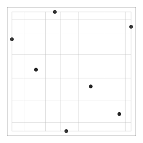
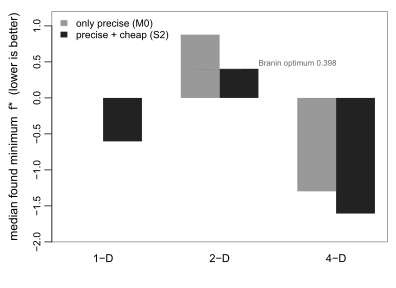
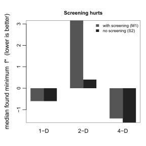
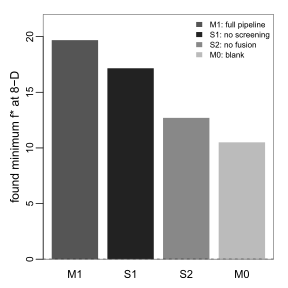
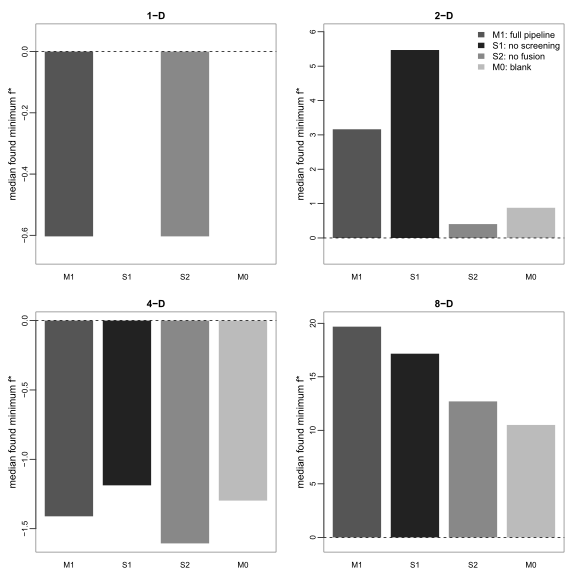

# Research on Multi-Fidelity Data-Based Optimization Algorithms

Hello everyone, I am **Wenje Ma**. Today I want to tell you about a piece of work I did. The full title is : **Research on Multi-Fidelity Data-Based Optimization Algorithms**. **Fidelity** just means how **faithful a test is**. A **high-fidelity** test is **expensive but precise**; a **low-fidelity** test is **cheap but a little off**. **Multi-fidelity** means we have **both**, and the question is how to use them **together** to find the best answer.

---

Here's my **plan**. First, a **quick story** to set up the problem. Then the **two simple ideas** my method is built on. Then **what I found** when I tested it. And finally, **where I'd like to go next**.

---

Let me start with the **story**. Imagine you work for a company, and your job is to **tune parameters**. You have an **experiment**, but **every run costs money**. You can only afford **few runs** in total. Here's the hard part: **more than ten parameters**, and **they affect each other**. Change one, the others **move too** — like an engine: raise the pressure, and the **temperature and the fuel mix** all shift together. So you can't tune them **one at a time**. You need the **best combination of all at a time**, and you get only **few chances** to find it. What would you do? That is exactly the **problem I worked on**. And it's not just a story — **engines, materials, biology**: many real systems are exactly like this. **Testing is expensive, few chances.** So the further question is, how do you **spend a tiny budget smartly**?

---

Why is this **hard**? **Two reasons.** First, the **black box**. A black box means you only see **input and output**, never the inside. It's like a **locked machine** — you put in a coin and read the result, but you can't open it. Our function is exactly that: we don't know its **shape**, we can only **poke it and watch**. In real life that black box is usually a **simulation or a test bench** — expensive to run, slow to answer, and we never see the **internal equations**. Second, the **budget**. We can run the real experiment only **few times**, but the space of settings is **enormous**. With that many parameters and that few chances, **guessing is hopeless**. So the further problem is: use **fifteen runs** to find the **best point** of a high-dimensional black box.

---

Now the good news: our black box has **two fidelities**. One is **low-fidelity** — cheap and fast, we can run it hundreds of times — but it has **bias**. It's like a **rough map**: the shape is there, the details are off. The other is **high-fidelity** — expensive and accurate, and we can only afford it **fifteen times**. So the further question is: how do we use the cheap low-fidelity runs to guide the **expensive high-fidelity ones**? My idea is **simple**. Think of the high-fidelity answer as the low-fidelity answer **plus a correction**:

$$
h_\mathrm{H}(\boldsymbol{x})=h_\mathrm{L}(\boldsymbol{x})+\delta(\boldsymbol{x})
$$

If we can **learn that correction** from a few high-fidelity runs, all those cheap low-fidelity runs suddenly become **useful**. It's like having a **cheap friend** who can run anywhere in the city quickly but only guesses the address, and an **expensive friend** who goes straight there but can only do it a few times. We let the **cheap friend scout**, and the **expensive friend confirm**.

---

Almost the whole skeleton of this method comes from **one person** — **V. Roshan Joseph**, a big name in experimental design.

{width=50%}

He gave us **two pieces**, and they map onto **two questions**. First, where do we put our first experiments? That's the **maxpro design**. Second, how do we add experiments one at a time? That's the **sequential design**. He built each piece **separately**, but never joined them **end to end**. So my work is simpler than it sounds: I took his two pieces, connected them into **one pipeline**, and tested whether **each piece earns its place**.

---

First piece — **where to start**. At the very beginning we **know nothing** about the function, so the first points should **cover the space evenly** — not piled in one corner, not overlapping. **Maxpro design** does exactly that. The name, **maximum projection**, means it keeps points spread out not just in the whole space, but in **every low-dimensional shadow**. So even if two points **look close** when you squash the space down, they're still **far apart** in the full space. The criterion is this equation, and the effect is in the figure:

$$
\min_D \sum_{i=1}^{n}\prod_{j\neq i}\frac{1}{\sum_{k=1}^p (x_{ik}-x_{jk})^2}
$$

{width=50%}

---

The second piece is the model that **guesses the shape** of the black box. That **stand-in** model is called a **Gaussian process**. Here's the simplest way to think about it. A **normal distribution** describes **one number** — it gives you the **average** and **how spread out** it is. A **Gaussian process** is the same idea, but for a **whole function** rather than one number. It gives a **whole curve** — and, just as important, it tells you **how unsure** it is at every point **along that curve**. That **uncertainty** is what makes it a **guide** rather than a guesser — a smart guesser that also tells you **how much to trust** each guess. We need it, because we have to decide **where to test next** — and the best place to test is where we're **hopeful and uncertain**.

---

Now **the whole pipeline**, in **four steps**. One, choose the **starting points**, spread out evenly. Two, feed the model with **many cheap low-fidelity points**; they go into the Gaussian process, and it draws a **rough map**. Three, run **one expensive high-fidelity test** where the model says the **destination** probably is. Four, **repeat** — every round the map **gets sharper**, and we get closer to the best point. It's exactly how a human engineer would work: **map, guess, test, refine**.

---

Here is the **formal question** I want to answer:

$$
\widehat{\boldsymbol{x}} \approx \argmin_{\boldsymbol{x}\in[0,1]^p} h_\mathrm{H}(\boldsymbol{x})
$$

Find the point that makes the high-fidelity function **as small as possible**, using only **fifteen high-fidelity tests**. I broke this into **three smaller questions**. First, does **combining the two fidelities** help? Second, does **screening** help — using cheap tests to decide **which parameters matter**, and **dropping the rest**? And third, does the whole thing still work **in high dimensions**?

---

Before I show results, let me say how I **measure success**. I ran the whole pipeline **twenty times** from scratch, because the starting points are **random**. Each run gives me the **best value it found**. Then I take the **median** of those twenty best values. Twenty runs prove **honestly**: one lucky run proves nothing; we want it happens **on average**. A lower number means a **better point**. So in every figure, **lower is better**.

Enough setup. Let me show you **what actually happened** when I ran it.

---

{width=50%}

First result: **combining the fidelities is the key**. With the same budget, **a few high-fidelity plus many low-fidelity beats only high-fidelity**. Low dimensions are the **clearest**. In **one dimension**, high-fidelity tests alone **can't find the best point** — it **stays at zero**. Add the low-fidelity runs and the fusion step, and it **jumps to the true best point**. In **two and four dimensions**, it lands very close to the **known best answer**. So if your tests are expensive, the message is clear: don't just run the expensive one — **bring a cheap one along to help**.

---

{width=50%}

Second result: **screening is useless** — it even **hurts**. Screening **ranks the parameters** with cheap tests, and keeps only the ones it calls important. But the cheap tests are **biased** — so the ranking is **unreliable**: the parameter it calls important might not matter at all in the high-fidelity function. When I **removed** the screening step, the results actually **got better**. My honest answer to that question is **no**: screening doesn't help, at least the way I set it up. It's a nice **counterintuitive finding**: the step that sounds like it saves work actually **costs you accuracy**.

---

{width=50%}

Third result: **high dimensions fail**. In **eight dimensions**, even fusion stops working — the **curse of dimensionality**. Here's what that phrase means. To sketch an **8-D landscape**, you need points scattered through **eight dimensions**; but we have only **fifteen precise points** — far too few to cover a space that big. It's the price of exploring a space that's **too big for the points we can afford** — the classic story of high dimensions: **more space, the same few points**. The map stays **nearly empty**, and the method **gets lost**. In low dimensions, fusion is the difference between **failing and finding the optimum**. In high dimensions, even fusion has a **ceiling**.

---

{width=100%}

Put all the results in one figure and the picture is **clear**. The **complete pipeline** is best in **low dimensions**. **Drop the fusion step**, and it breaks even in low dimensions. In **high dimensions**, nothing works. So it all comes down to **one sentence**: it's not about **spending more money** on high-fidelity tests — it's about **making each precise test more valuable** by leaning on the cheap ones. And the limit is set by **how many dimensions** you're working in — the story just **gets worse the higher you go**.

---

**Three directions** next. First, **when is screening trustworthy**? It failed because of **bias**. So the open question is: under what conditions does the cheap-test ranking actually match the **true ranking**? If we know that, we can **check before screening**, and only screen when it's **safe**. Second, how do we **break the curse of dimensionality**? It already fails at **eight dimensions**. Maybe we can put some **structure on the bias**, or **shrink the dimension** before we start. The first step is probably just to **push to more dimensions** and find where the line is. Third, **push it into the real world** — engines, materials, biology, anywhere experiments actually cost money. Maybe even build a **tool**: you tell it your **budget**, and it gives you the **best plan** on its own.

---

Let me close with **one sentence**. When tests are expensive, the smartest thing isn't to run more high-fidelity ones — it's to **make every single one count**, by letting cheap low-fidelity runs do the **heavy lifting**. That's **multi-fidelity** in one line — and that's exactly what my title promises: **Research on Multi-Fidelity Data-Based Optimization Algorithms**. **Thank you for listening**!
